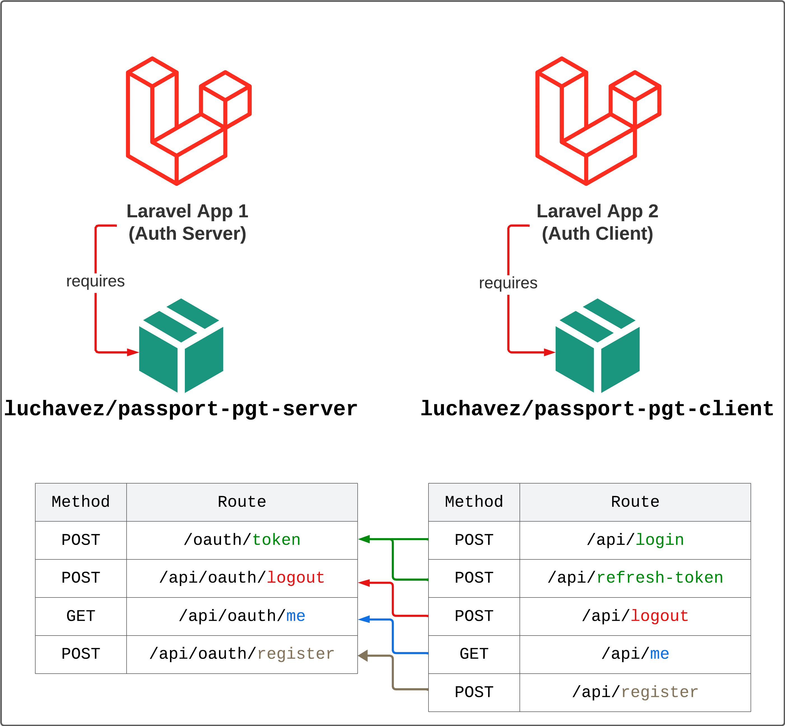

# Passport Password Grant Tokens (PGC) Server for Laravel 8|9|10

[![Latest Version on Packagist][ico-version]][link-packagist]
[![Total Downloads][ico-downloads]][link-downloads]
[![Discord][ico-discord]][link-discord]

**Laravel Passport** is an authentication package for Laravel. It is used by a lot of Laravel apps to authenticate users before accessing any resources. Basically, it generates an `access token` which you can then use on every request to provide identification to the `OAuth Server`.

One of Laravel Passport's mostly used authentication methods is the [`Password Grant Tokens`](https://laravel.com/docs/8.x/passport#password-grant-tokens) grant type. It is a stateless way to get `access tokens` and `refresh tokens` from the `OAuth Server`.

Take a look at [contributing.md](contributing.md) if you want to contribute to this project.



## Installation

Via Composer

``` bash
$ composer require luchavez/passport-pgt-server
```

## Setting Up

1. Run `php artisan migrate` to create the Passport related tables.

2. Use Passport's `Laravel\Passport\HasApiTokens` on User model.

3. Add these variables to `.env` file if you want to override the default values.

| Variable Name             | Default Value |
|---------------------------|---------------|
| `PPS_AT_EXPIRE_UNIT`      | days          |
| `PPS_AT_EXPIRE_VALUE`     | 15            |
| `PPS_RT_EXPIRE_UNIT`      | days          |
| `PPS_RT_EXPIRE_VALUE`     | 30            |
| `PPS_PAT_EXPIRE_UNIT`     | days          |
| `PPS_PAT_EXPIRE_VALUE`    | 6             |
| `PPS_HASH_CLIENT_SECRETS` | false         |

## Usage

### Passport PGT Server

The package provides a service called [**PassportPgtServer**](src/Services/PassportPgtServer.php) which you can use by calling its [helper functions](helpers/passport-pgt-server-helper.php):
1. `passportPgtServer()`
2. `passport_pgt_server()`

Here's the list of its available methods.

| Method Name                             | Return Type                            | Description                                                     |
|-----------------------------------------|----------------------------------------|-----------------------------------------------------------------|
| `setPassportAsApiDriver`                | `void`                                 | adds `api` authentication guard with `passport` as driver       |
| `setAuthServerController`               | `void`                                 | sets the `AuthServerController`                                 |
| `getAuthServerController`               | `array`                                | gets the `AuthServerController`                                 |
| `setLogoutAuthController`               | `void`                                 | sets the `LogoutAuthController`                                 |
| `getLogoutAuthController`               | `array`                                | gets the `LogoutAuthController`                                 |
| `setMeAuthController`                   | `void`                                 | sets the `MeAuthController`                                     |
| `getMeAuthController`                   | `array`                                | gets the `MeAuthController`                                     |
| `hashClientSecrets`                     | `bool`                                 | decides whether to hash or not client's secrets                 |
| `getTokensExpiresInUnit`                | `string`                               | gets the time unit for access token expiration                  |
| `getTokensExpiresInValue`               | `int`                                  | gets the time value for access token expiration                 |
| `getTokensExpiresIn`                    | `Illuminate\Support\Carbon`            | gets the `Carbon` datetime for access token expiration          |
| `getRefreshTokensExpiresInUnit`         | `string`                               | gets the time unit for refresh token expiration                 |
| `getRefreshTokensExpiresInValue`        | `int`                                  | gets the time value for refresh token expiration                |
| `getRefreshTokensExpiresIn`             | `Illuminate\Support\Carbon`            | gets the `Carbon` datetime for refresh token expiration         |
| `getPersonalAccessTokensExpiresInUnit`  | `string`                               | gets the time unit for personal access token expiration         |
| `getPersonalAccessTokensExpiresInValue` | `int`                                  | gets the time unit for personal access token expiration         |
| `getPersonalAccessTokensExpiresIn`      | `Illuminate\Support\Carbon`            | gets the `Carbon` datetime for personal access token expiration |
| `getTokenModel`                         | `string`                               | gets the model class name                                       |
| `getTokenBuilder`                       | `Illuminate\Database\Eloquent\Builder` | gets the model builder instance                                 |
| `getRefreshTokenModel`                  | `string`                               | gets the model class name                                       |
| `getRefreshTokenBuilder`                | `Illuminate\Database\Eloquent\Builder` | gets the model builder instance                                 |
| `getPersonalAccessTokenModel`           | `string`                               | gets the model class name                                       |
| `getPersonalAccessTokenBuilder`         | `Illuminate\Database\Eloquent\Builder` | gets the model builder instance                                 |
| `getClientModel`                        | `string`                               | gets the model class name                                       |
| `getClientBuilder`                      | `Illuminate\Database\Eloquent\Builder` | gets the model builder instance                                 |

### Routes

By default, `laravel/passport` adds authentication related routes. This package adds two new routes: `/api/oauth/logout` and `/api/oauth/me`.

Here's the list of routes that this package provides.

| Method | Route               | Description                                                         |
|--------|---------------------|---------------------------------------------------------------------|
| POST   | `/oauth/token`      | Added by `laravel/passport`. This route generates the tokens.       |
| POST   | `/api/oauth/logout` | This route revokes the current `access token` with `refresh token`. |
| GET    | `/api/oauth/me`     | This route returns the access token's user information.             |

*Note*: If you wish to override the logout or get self logic, feel free to do so by using these methods from `PassportPgtServer` class:
- `setAuthServerController()`
- `setLogoutAuthController()`
- `setMeAuthController()`

## Change log

Please see the [changelog](changelog.md) for more information on what has changed recently.

## Testing

``` bash
$ composer test
```

## Contributing

Please see [contributing.md](contributing.md) for details and a todolist.

## Security

If you discover any security related issues, please email jamescarloluchavez@gmail.com instead of using the issue tracker.

## Credits

- [James Carlo Luchavez][link-author]
- [All Contributors][link-contributors]

## License

MIT. Please see the [license file](license.md) for more information.

[ico-version]: https://img.shields.io/packagist/v/luchavez/passport-pgt-server.svg?style=flat-square
[ico-downloads]: https://img.shields.io/packagist/dt/luchavez/passport-pgt-server.svg?style=flat-square
[ico-travis]: https://img.shields.io/travis/luchavez/passport-pgt-server/master.svg?style=flat-square
[ico-styleci]: https://styleci.io/repos/12345678/shield
[ico-discord]: https://img.shields.io/discord/1143744619956404295?color=8c9eff&label=Discord&logo=discord

[link-packagist]: https://packagist.org/packages/luchavez/passport-pgt-server
[link-downloads]: https://packagist.org/packages/luchavez/passport-pgt-server
[link-travis]: https://travis-ci.org/luchavez/passport-pgt-server
[link-styleci]: https://styleci.io/repos/12345678
[link-author]: https://github.com/luchavez-technologies
[link-contributors]: ../../contributors
[link-discord]: https://discord.gg/bFpDTgp3
